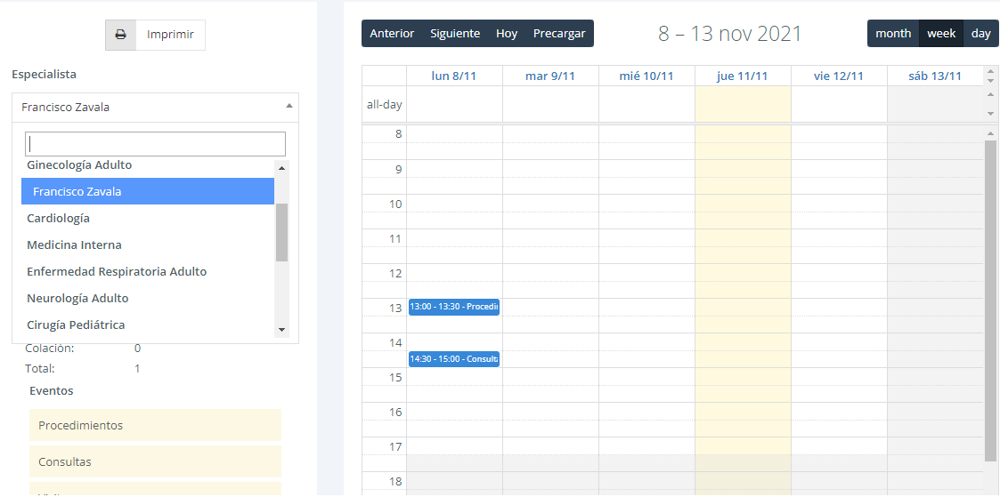
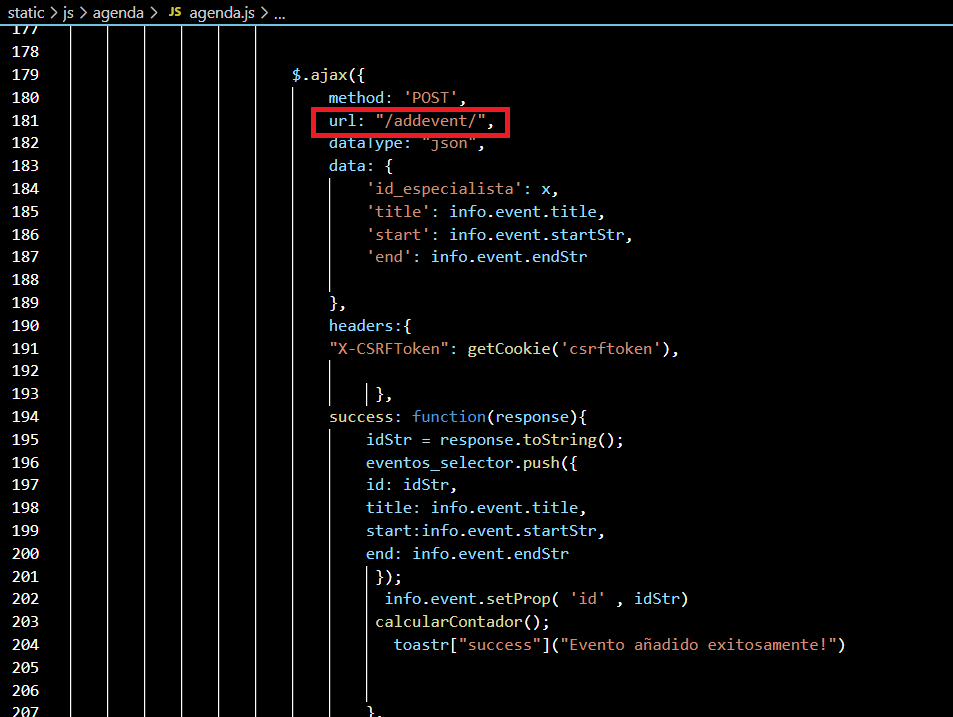

# proyecto_titulo

En estas líneas de no-codigo se comentarán las funcionalidades más importantes del sistema.

FullCalendar: Para satisfacer la necesidad de gestionar las actividades calendarizadas de los especialistas que estén registrados en el sistema, se utilizó FullCalendar,
un plugin que permite crear un calendario y registrar eventos en el.

Para cada especialista registrado en el sistema, se desplegará un calendario único con eventos únicos. Al momento de realizar cualquier CRUD entre los eventos
de un especialista y el calendario, se realiza una petición AJAX hacia el servidor solicitando acceso a la BD. (static/js/agenda/agenda.js)

